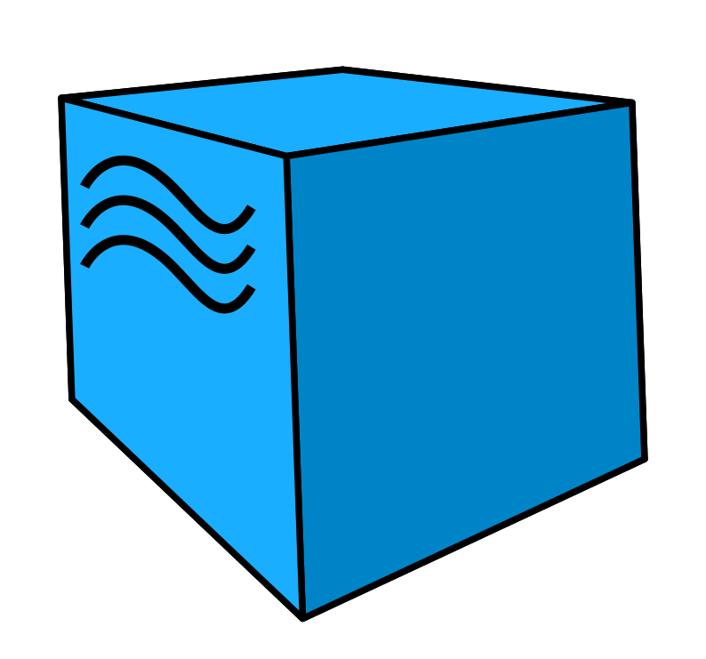

<h1 align="left">Hey, I'm Julyan!   </h1>
I'm a dedicated <code>QA Specialist</code> with a solid background in manual and automation testing.

---
## 🛠️ Technologies:

    
    
    
    
    
    
    
    
    
    
    
    
    
    

 List of technologies and languages I've had experience with in the past, or use currently.

----
## 🚀  Skills:
- **Manual and Automation Testing** — designing test strategies and executing manual & automated test suites  
- **Test Scenario Creation** — creating test plans, test cases and automation scenarios  
- **Database Management** — working with relational databases and SQL queries  
- **API Testing** — testing REST APIs with Postman and Rest Assured  
- **UI Automation Testing** — developing automated UI tests using **Java, Selenide and JUnit5**  
- **CI/CD Workflow Management** — integrating automated tests into **Jenkins pipelines**  
- **Test Management Tools** — managing tasks and defects in **Jira / Confluence**

----

## 📂 Projects:

---

## 📫 Get in Touch

